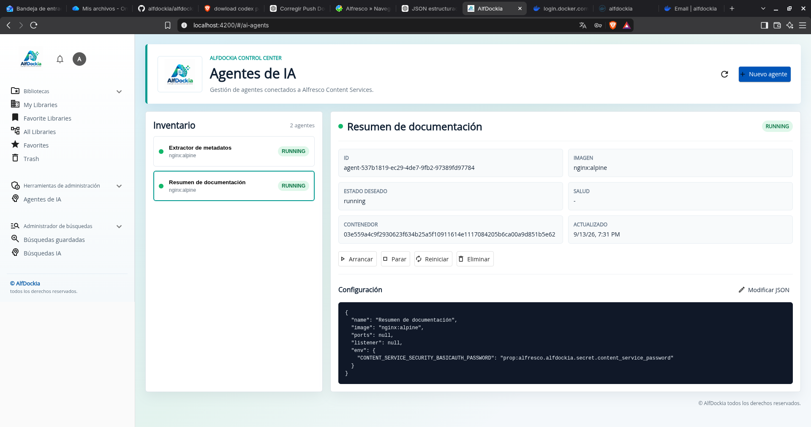
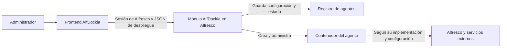

<p align="center">
  
</p>

<h1 align="center">alfdockia-content-app</h1>

<p align="center">
  Crea, configura y administra agentes desde tu entorno documental.
</p>

AlfDockia incorpora a Alfresco Content Services un espacio de administración desde el que desplegar agentes como contenedores Docker. Desde una misma pantalla puedes dar de alta un agente, consultar su configuración, comprobar si está ejecutándose y controlar su ciclo de vida.

**Versión del aplicativo: 1.2.2 · Empresa: AIgen Technologies S.L**

Este proyecto es la interfaz web de AlfDockia, construida sobre **Alfresco Content App 8, Angular 20 y Alfresco ADF 9**. Se conecta al módulo AlfDockia del repositorio para convertir una definición JSON en un agente desplegado y registrado en Alfresco.

## ¿Qué es un agente en AlfDockia?

Un agente es un servicio que ejecuta una tarea y que AlfDockia administra mediante una imagen Docker y una configuración. Esa imagen contiene el programa que realiza el trabajo; el JSON indica qué imagen ejecutar y qué parámetros necesita para funcionar en tu entorno.

Por ejemplo, una imagen puede implementar un listener que reacciona a eventos documentales, un extractor de metadatos o un servicio que genera resúmenes. La tarea concreta, los modelos de IA y los servicios externos utilizados dependen de la implementación de esa imagen. El nombre que escribes en el formulario sirve para identificar al agente: su comportamiento lo determina el software que despliegas.

Cada agente tiene tres elementos relacionados:

| Elemento | Qué representa |
| --- | --- |
| **Definición** | El nombre, la imagen Docker, los puertos y las variables con las que se desplegará. |
| **Registro en Alfresco** | Su identidad, configuración y datos operativos, almacenados por el módulo AlfDockia. |
| **Contenedor** | La instancia del programa que Docker ejecuta y que puedes arrancar, parar o recrear. |

Así puedes administrar distintos agentes desde Alfresco, aunque cada uno tenga su propia imagen y sus propias necesidades de configuración.

## La consola de agentes



La captura muestra el espacio **Agentes de IA**, con el inventario a la izquierda y el detalle del agente seleccionado a la derecha. Los nombres «Extractor de metadatos» y «Resumen de documentación» ilustran cómo organizar los agentes por su finalidad. En esta captura ambos utilizan `nginx:alpine` como imagen de prueba; las funciones de extracción o resumen requieren una imagen que las implemente.

La pantalla reúne las operaciones necesarias para administrar un agente:

| Zona | Qué puedes hacer |
| --- | --- |
| **Nuevo agente** | Abrir el editor y enviar una nueva definición de despliegue. |
| **Inventario** | Ver los agentes registrados, sus nombres, imágenes y estados. |
| **Detalle** | Consultar el ID, el contenedor asociado, el estado deseado, la salud y la última actualización. |
| **Configuración** | Revisar el JSON del agente seleccionado. |
| **Acciones** | Arrancar, parar, reiniciar, modificar la configuración o eliminar el agente. |
| **Actualizar** | Volver a consultar el inventario y el detalle seleccionado. |

## Cómo se conectan los agentes con Alfresco



El frontend envía las operaciones utilizando la sesión de Alfresco del administrador. El módulo del repositorio valida la solicitud, administra el contenedor y mantiene el registro del agente. El navegador no necesita acceso al motor Docker.

El agente se conecta a Alfresco y a otros servicios con las variables que necesita su imagen. Por ejemplo, un listener puede necesitar la URL del repositorio, las credenciales de una cuenta de servicio y la dirección del broker de eventos. Esos parámetros se definen en el JSON del agente; iniciar sesión en el frontend no configura automáticamente las credenciales del contenedor.

El backend conserva el registro en **Repositorio → Data Dictionary → Alfdockia Agents**. Cada agente tiene un nodo de registro y su definición se almacena como contenido JSON. Las referencias a secretos permiten conservar esa configuración sin escribir el valor del secreto en el JSON.

## Antes de empezar

Para crear agentes necesitas:

- **Acceso de administrador a Alfresco.** La opción se encuentra en **Herramientas de administración → Agentes de IA**; su ruta interna es `#/ai-agents`.
- **El módulo AlfDockia instalado y configurado en Alfresco.** El frontend utiliza sus Web Scripts para gestionar los agentes.
- **Un entorno Docker accesible para el backend.** Es donde se crearán los contenedores.
- **La imagen del agente disponible para el despliegue.** Debe cumplir las restricciones de imágenes configuradas en el backend, si las hay.
- **Conectividad y configuración del agente.** Sus servicios de destino deben ser accesibles desde la red del contenedor; los secretos referenciados deben existir en el backend.

## Crear tu primer agente

### 1. Abre el formulario

Entra en **Agentes de IA** y pulsa **Nuevo agente**. El diálogo **Nuevo agente de IA** contiene un editor JSON con una plantilla inicial.

Antes de enviarla, elige un nombre único e identifica la imagen que realmente quieres ejecutar. Después ajusta los puertos, las variables de entorno y, si corresponde, la referencia al secreto del listener.

### 2. Prueba el despliegue con un contenedor sencillo

Para comprobar el circuito de creación y gestión de contenedores puedes utilizar esta definición, siempre que tu backend permita y pueda obtener la imagen `nginx:alpine`:

```json
{
  "name": "prueba-despliegue",
  "image": "nginx:alpine",
  "ports": [
    {
      "containerPort": 80,
      "hostPort": 18080,
      "protocol": "tcp"
    }
  ],
  "env": {}
}
```

Este ejemplo levanta un servidor web de prueba. Sirve para verificar que AlfDockia crea el registro y administra el contenedor. Para realizar una tarea documental, sustituye la imagen por la de tu agente y proporciona la configuración que esa imagen requiere.

El puerto `18080` debe estar libre en la máquina donde Docker ejecuta el agente. Si el entorno permite acceder a ese puerto, el servidor de prueba estará disponible en `http://<host-docker>:18080`. No tiene por qué ser la máquina donde abres el navegador.

### 3. Revisa y despliega

En el editor tienes estas opciones:

- **Formatear:** presenta el JSON con sangría para facilitar su revisión.
- **Ejemplo:** reemplaza el contenido por la plantilla inicial de la aplicación.
- **Cancelar:** cierra el diálogo sin crear el agente.
- **Desplegar agente:** envía la definición al backend.

El editor comprueba la sintaxis JSON. El backend realiza la validación del despliegue. Si se produce un error, la pantalla muestra el mensaje recibido para que puedas corregir la configuración.

### 4. Comprueba el agente creado

Después de recibir la confirmación, la aplicación actualiza el inventario y selecciona el agente creado. Comprueba el identificador del contenedor y su estado. Pulsa **Actualizar** para consultar de nuevo los datos.

Un estado `running` indica que el contenedor está en ejecución. La comprobación de salud, cuando está disponible, aporta información adicional. Para confirmar que el agente realiza su tarea documental, comprueba también el resultado esperado de esa tarea y los registros del servicio.

## Configurar un agente documental

La definición de despliegue sigue el mismo formato que el ejemplo anterior, pero la imagen y las variables deben corresponder al agente que vas a utilizar.

El siguiente ejemplo ilustra un listener conectado a Alfresco y a ActiveMQ. **Sustituye `mi-registro/mi-listener:1.0.0` por tu imagen** y adapta las variables a su contrato de configuración:

```json
{
  "name": "listener-documental",
  "image": "mi-registro/mi-listener:1.0.0",
  "listener": {
    "passwordSecretRef": {
      "secretRef": "prop:alfresco.alfdockia.secret.content_service_password"
    },
    "passwordEnvName": "CONTENT_SERVICE_SECURITY_BASICAUTH_PASSWORD"
  },
  "env": {
    "CONTENT_SERVICE_URL": "http://alfresco:8080",
    "CONTENT_SERVICE_PATH": "/alfresco/api/-default-/public/alfresco/versions/1",
    "CONTENT_SERVICE_SECURITY_BASICAUTH_USERNAME": "cuenta-del-agente",
    "SPRING_ACTIVEMQ_BROKER_URL": "tcp://activemq:61616"
  }
}
```

Este JSON es una guía de configuración, no una imagen de agente incluida en el frontend. El listener debe implementar la conexión al broker, el procesamiento de los eventos y las operaciones documentales correspondientes.

### Qué significa cada campo

| Campo | Uso |
| --- | --- |
| `name` | Nombre único del agente en el registro. |
| `image` | Imagen Docker que contiene el programa del agente, con su etiqueta. |
| `ports` | Mapeos de puertos opcionales. Un listener que solo realiza conexiones salientes puede no necesitar publicar puertos. |
| `ports[].containerPort` | Puerto en el que escucha el proceso dentro del contenedor. |
| `ports[].hostPort` | Puerto publicado en el host Docker. |
| `ports[].protocol` | Protocolo del mapeo, por ejemplo `tcp`. |
| `listener.passwordSecretRef.secretRef` | Referencia al secreto que resolverá el backend. |
| `listener.passwordEnvName` | Variable de entorno que recibirá el secreto; por defecto, `CONTENT_SERVICE_SECURITY_BASICAUTH_PASSWORD`. |
| `env` | Variables de entorno específicas de la imagen del agente. |

AlfDockia transporta las variables de `env` al contenedor. Su significado lo define la imagen: no hay un conjunto universal de variables de IA que sirva para todos los agentes.

### Direcciones de red

Las URLs del JSON se interpretan **desde el contenedor del agente**. En una red Docker compartida, `alfresco` y `activemq` pueden ser nombres de servicios del Compose. Deben coincidir con los nombres accesibles en tu despliegue.

Dentro de un contenedor, `localhost` identifica a ese mismo contenedor. Para conectar con el repositorio debes utilizar el nombre de servicio o la dirección de Alfresco accesible desde esa red.

### Contraseñas y referencias a secretos

El backend resuelve referencias con el formato `prop:<clave>` contra las propiedades globales de Alfresco. La propiedad debe contener la contraseña que necesita la cuenta del agente.

También puedes declarar la referencia directamente en `env`, como alternativa al bloque `listener`:

```json
{
  "env": {
    "CONTENT_SERVICE_SECURITY_BASICAUTH_PASSWORD": "prop:alfresco.alfdockia.secret.content_service_password"
  }
}
```

Este último fragmento se integra en la definición completa del agente. El registro conserva la referencia; el backend resuelve su valor al preparar el contenedor.

## Gestionar el agente después de crearlo

Selecciona un agente del inventario para acceder a sus acciones:

| Acción | Resultado |
| --- | --- |
| **Arrancar** | Solicita al backend que inicie el agente. |
| **Parar** | Detiene su ejecución y conserva el registro para poder gestionarlo después. |
| **Reiniciar** | Abre el JSON y permite confirmar la recreación del contenedor. |
| **Modificar JSON** | Abre el mismo formulario de reinicio para cambiar la configuración y aplicarla al recrear el agente. |
| **Eliminar** | Solicita confirmación y elimina el agente, su registro y el contenedor asociado. |

Por ejemplo, para cambiar la dirección de un servicio externo, selecciona el agente, pulsa **Modificar JSON**, actualiza la variable correspondiente y confirma **Reiniciar agente**. Después revisa el nuevo estado y la configuración mostrada en el detalle.

### Interpretar el estado

| Información | Cómo interpretarla |
| --- | --- |
| **Estado actual** | Situación de ejecución informada por el backend, como `running`, `stopped` o `exited`. |
| **Estado deseado** | Situación que se ha solicitado para el agente. Puede diferir del estado actual si una operación falla. |
| **Salud** | Resultado de la comprobación de salud cuando está disponible; un guion indica que no se ha informado. |
| **Contenedor** | Identificador que permite localizar la instancia en Docker. |
| **Actualizado** | Última actualización registrada por el backend. |

## Resolver problemas de creación y arranque

| Problema | Qué comprobar |
| --- | --- |
| No aparece **Agentes de IA** | Los permisos de administrador de tu sesión de Alfresco. |
| **El JSON no es válido** | Comillas, comas, llaves y corchetes del editor. |
| El nombre ya existe | Utiliza un nombre único o modifica el agente existente. |
| No se encuentra el WebScript de agentes | La instalación del módulo AlfDockia en el repositorio al que se conecta el frontend. |
| El despliegue rechaza la imagen | Su nombre y etiqueta, su disponibilidad y las restricciones configuradas en el backend. |
| No se puede publicar un puerto | Si `hostPort` ya está ocupado en el host Docker. |
| No se resuelve un secreto | La existencia de la propiedad referenciada y el formato `prop:<clave>`. |
| El contenedor arranca y se detiene | Los registros del agente y las variables exigidas por su imagen. |
| El agente no conecta con Alfresco o ActiveMQ | Las direcciones, credenciales y conectividad desde la red del contenedor. |
| Aparece `running`, pero no hay resultados documentales | La lógica de la imagen, sus eventos de entrada, los permisos de la cuenta de servicio y sus dependencias externas. |

## Código de la extensión

La funcionalidad de agentes se implementa en [`projects/aca-ai-agents`](projects/aca-ai-agents):

- [`ai-agents-page.component.ts`](projects/aca-ai-agents/src/lib/ai-agents-page.component.ts): inventario, selección y acciones del agente.
- [`ai-agent-json-dialog.component.ts`](projects/aca-ai-agents/src/lib/ai-agent-json-dialog.component.ts): edición del JSON de creación y reinicio.
- [`ai-agents.service.ts`](projects/aca-ai-agents/src/lib/ai-agents.service.ts): llamadas autenticadas a los Web Scripts del repositorio.
- [`ai-agents.models.ts`](projects/aca-ai-agents/src/lib/ai-agents.models.ts): contrato de datos y plantilla del formulario.
- [`ai-agents-admin.guard.ts`](projects/aca-ai-agents/src/lib/ai-agents-admin.guard.ts): comprobación de acceso de administrador.

Las operaciones utilizan la ruta base `/alfresco/s/api/-default-/public/alfdockia/versions/1/agents`. La creación envía un `POST` con el JSON del formulario; el backend se encarga de persistirlo y desplegar el agente.

La documentación técnica heredada de Alfresco Content App se conserva en [`docs`](docs). Los términos de licencia del repositorio están en [`LICENSE`](LICENSE).

## Copyright y atribuciones

Copyright © 2026 AIgen Technologies S.L. Todos los derechos reservados sobre las aportaciones propias, conforme a la licencia aplicable.

Este proyecto se basa en Alfresco Content App. Se conservan los avisos de autoría de Hyland Software y demás terceros, así como las licencias correspondientes. Consulta [LICENSE](LICENSE) y [NOTICE](NOTICE).
